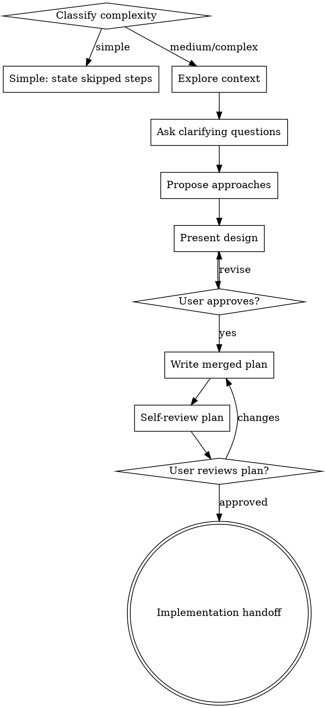

# Brainstorming Ideas Into Designs

Help turn ideas into clear designs before implementation. Scale process to task complexity; user instructions override this rubric.

## Complexity Decision

Classify before starting and state the result.

- **Simple**: single-file text/config/doc tweak, low risk, reversible, no behavior change. You may skip written design docs, TDD, subagents, and review. Say: `Simple task: skipping <steps> because <reason>.`
- **Medium**: behavior change, multi-file edit, user-facing workflow, or moderate risk. Use short brainstorming, targeted tests where useful, and concise verification.
- **Complex**: new feature, architecture change, bug hunt, risky refactor, security/data risk, or unclear requirements. Use full brainstorming, merged plan, TDD, verification, and review.

<HARD-GATE>
For medium/complex work, do NOT invoke implementation skills, write implementation code, scaffold projects, or edit behavior until you present a design and user approves it. For simple work, state the skipped steps and proceed only when assumptions are obvious or user already supplied enough detail.
</HARD-GATE>

## Checklist

For medium/complex work, create tasks and complete in order:

1. **Explore project context** — check files, docs, recent commits
2. **Ask clarifying questions** — one at a time, understand purpose/constraints/success criteria
3. **Propose 2-3 approaches** — trade-offs and recommendation
4. **Present design** — sections scaled to complexity, get approval
5. **Write merged plan** — save design + implementation plan to `docs/YYYY-MM-DD-<topic>-plan.md`
6. **Plan self-review** — check placeholders, contradictions, ambiguity, scope
7. **User reviews merged plan** — ask user to review before execution
8. **Transition to implementation** — invoke writing-plans only if plan still needs detailed task breakdown, otherwise execute approved plan with appropriate implementation skill

## Process Flow



## Understanding the Idea

- Check current project state first: files, docs, recent commits.
- If request spans independent subsystems, decompose before detail work.
- Ask one question at a time; prefer multiple choice when helpful.
- Focus on purpose, constraints, success criteria.

## Exploring Approaches

- Propose 2-3 approaches with tradeoffs.
- Lead with recommendation and reason.
- Use YAGNI: remove features not needed for goal.

## Presenting Design

Scale sections to complexity. Cover:

- Architecture / affected components
- Data flow or command flow
- Error handling and edge cases
- Testing and verification
- Migration or compatibility when relevant

Ask whether each section looks right before continuing.

## Merged Plan Document

After approval, write one file:

`docs/YYYY-MM-DD-<topic>-plan.md`

Include:

```markdown
# <Topic> Plan

## Design Summary
## Requirements
## Non-goals
## Approach / Architecture
## Implementation Plan
## Validation
```

**Do not commit generated markdown.** Leave the file unstaged/uncommitted unless the user explicitly asks to commit it.

## Self-Review

Before asking user to review:

1. **Placeholder scan:** no TBD/TODO/incomplete sections.
2. **Consistency:** requirements, architecture, and tasks agree.
3. **Scope:** plan is small enough to execute; otherwise decompose.
4. **Ambiguity:** choose one interpretation and write it explicitly.

Fix issues inline.

## User Review Gate

Say:

> "Merged plan written to `<path>`. I did not commit it. Please review it and tell me if you want changes before implementation."

Wait for approval. If user requests changes, update plan and repeat self-review.

## Workflow Monitor Handoff

Runtime monitor recognizes merged plan artifacts at `docs/*-plan.md`.
For fresh execution: `/workflow-next execute <plan-path>`.

## Key Principles

- Complexity decides process weight.
- User explicit workflow instruction wins.
- One question at a time.
- Explore alternatives.
- Get approval before medium/complex implementation.
- Do not auto-commit generated markdown.
